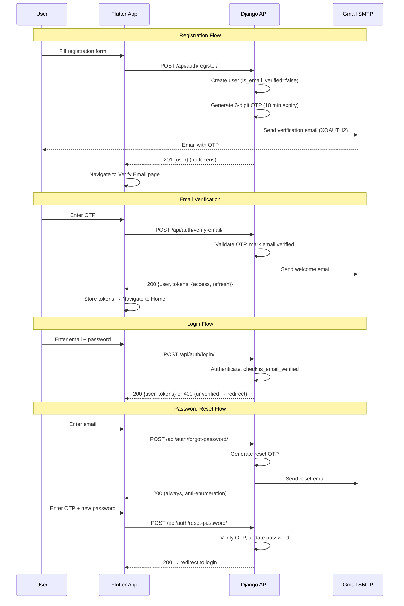
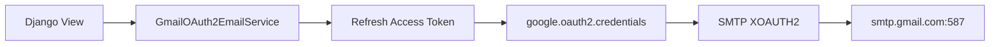

# Authentication Architecture

## Overview

Stateless JWT-based authentication with mandatory email verification (OTP) before first login. Transactional emails sent via Gmail OAuth 2.0 SMTP (XOAUTH2).

## Auth Flow

## Token Strategy

| Token | Lifetime | Storage (Flutter) | Purpose |
|-------|----------|-------------------|---------|
| Access | 30 min | `flutter_secure_storage` | API authorization (`Bearer` header) |
| Refresh | 7 days | `flutter_secure_storage` | Obtain new access tokens |

- **Blacklisting**: On logout, refresh token is blacklisted via `django-rest-framework-simplejwt` token blacklist.
- **Auto-login**: On app start, the stored refresh token is used to obtain a new access token. If expired, user is redirected to login.

## Security Measures

| Measure | Implementation |
|---------|----------------|
| Password hashing | Django's PBKDF2 (default) |
| OTP exclusivity | New OTP invalidates all previous OTPs for that user |
| OTP expiry | 10 minutes (configurable via `OTP_EXPIRY_MINUTES`) |
| Anti-enumeration | Forgot-password always returns 200 regardless of email existence |
| Email gate | Login blocked until `is_email_verified = true` |
| Token blacklist | Refresh tokens blacklisted on logout |
| CORS | Restricted to configured origins only |

## Email Service

- Uses `google-auth` to refresh OAuth 2.0 access tokens from a stored refresh token
- Authenticates to Gmail SMTP via `XOAUTH2` (not app passwords)
- Three branded HTML templates: welcome, verification OTP, password reset OTP
