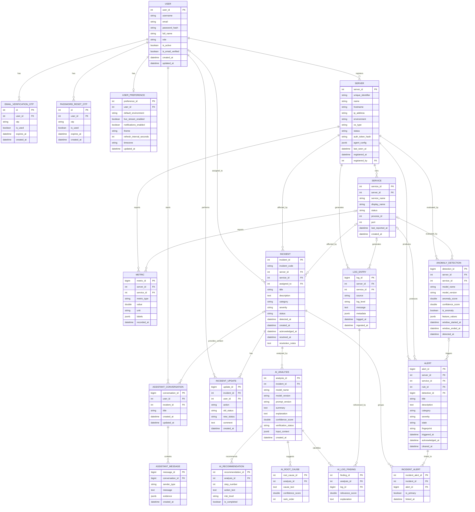

# Mermaid Editor code for ER diagram

```mermaid
erDiagram

    USER {
        int user_id PK
        string username
        string email
        string password_hash
        string full_name
        string role
        boolean is_active
        boolean is_email_verified
        datetime created_at
        datetime updated_at
    }

    EMAIL_VERIFICATION_OTP {
        int id PK
        int user_id FK
        string otp
        boolean is_used
        datetime expires_at
        datetime created_at
    }

    PASSWORD_RESET_OTP {
        int id PK
        int user_id FK
        string otp
        boolean is_used
        datetime expires_at
        datetime created_at
    }

    USER_PREFERENCE {
        int preference_id PK
        int user_id FK
        string default_environment
        boolean live_stream_enabled
        boolean notifications_enabled
        string theme
        int refresh_interval_seconds
        string timezone
        datetime updated_at
    }

    SERVER {
        int server_id PK
        string unique_identifier
        string name
        string hostname
        string ip_address
        string environment
        string os_type
        string status
        string auth_token_hash
        jsonb agent_config
        datetime last_seen_at
        datetime registered_at
        int registered_by FK
    }

    SERVICE {
        int service_id PK
        int server_id FK
        string service_name
        string display_name
        string status
        int process_id
        int port
        datetime last_reported_at
        datetime created_at
    }

    METRIC {
        bigint metric_id PK
        int server_id FK
        int service_id FK
        string metric_type
        double value
        string unit
        jsonb labels
        datetime recorded_at
    }

    LOG_ENTRY {
        bigint log_id PK
        int server_id FK
        int service_id FK
        string source
        string log_level
        text message
        jsonb metadata
        datetime logged_at
        datetime ingested_at
    }

    ANOMALY_DETECTION {
        bigint detection_id PK
        int server_id FK
        int service_id FK
        string model_name
        string model_version
        double anomaly_score
        double confidence_score
        boolean is_anomaly
        jsonb feature_values
        datetime window_started_at
        datetime window_ended_at
        datetime detected_at
    }

    ALERT {
        bigint alert_id PK
        int server_id FK
        int service_id FK
        int rule_id FK
        bigint detection_id FK
        string title
        text description
        string category
        string severity
        string state
        string fingerprint
        datetime triggered_at
        datetime acknowledged_at
        datetime cleared_at
    }

    INCIDENT {
        int incident_id PK
        string incident_code
        int server_id FK
        int service_id FK
        int assigned_to FK
        string title
        text description
        string category
        string severity
        string status
        datetime detected_at
        datetime created_at
        datetime acknowledged_at
        datetime resolved_at
        text resolution_notes
    }

    INCIDENT_ALERT {
        int incident_alert_id PK
        int incident_id FK
        bigint alert_id FK
        boolean is_primary
        datetime linked_at
    }

    INCIDENT_UPDATE {
        bigint update_id PK
        int incident_id FK
        int user_id FK
        string action
        string old_status
        string new_status
        text comment
        datetime created_at
    }

    AI_ANALYSIS {
        int analysis_id PK
        int incident_id FK
        string model_name
        string model_version
        string prompt_version
        text summary
        text explanation
        double confidence_score
        string verification_status
        jsonb input_context
        datetime created_at
    }

    AI_ROOT_CAUSE {
        int root_cause_id PK
        int analysis_id FK
        text cause_text
        double confidence_score
        int rank_order
    }

    AI_RECOMMENDATION {
        int recommendation_id PK
        int analysis_id FK
        int step_number
        text action_text
        string risk_level
        boolean is_completed
    }

    AI_LOG_FINDING {
        int finding_id PK
        int analysis_id FK
        bigint log_id FK
        double relevance_score
        text explanation
    }

    ASSISTANT_CONVERSATION {
        bigint conversation_id PK
        int user_id FK
        int incident_id FK
        string title
        datetime created_at
        datetime updated_at
    }

    ASSISTANT_MESSAGE {
        bigint message_id PK
        bigint conversation_id FK
        string sender_type
        text message
        jsonb evidence
        datetime created_at
    }

    USER ||--o| USER_PREFERENCE : has
    USER ||--o{ SERVER : registers
    USER ||--o{ EMAIL_VERIFICATION_OTP : has
    USER ||--o{ PASSWORD_RESET_OTP : has
    USER |o--o{ INCIDENT : assigned_to
    USER ||--o{ INCIDENT_UPDATE : performs
    USER ||--o{ ASSISTANT_CONVERSATION : starts

    SERVER ||--o{ SERVICE : runs
    SERVER ||--o{ METRIC : reports
    SERVER ||--o{ LOG_ENTRY : generates
    SERVER ||--o{ ANOMALY_DETECTION : evaluated_by
    SERVER ||--o{ ALERT : produces
    SERVER ||--o{ INCIDENT : affected_by

    SERVICE |o--o{ METRIC : reports
    SERVICE |o--o{ LOG_ENTRY : generates
    SERVICE |o--o{ ANOMALY_DETECTION : evaluated_by
    SERVICE |o--o{ ALERT : produces
    SERVICE |o--o{ INCIDENT : affected_by

    ANOMALY_DETECTION |o--o{ ALERT : triggers

    INCIDENT ||--o{ INCIDENT_ALERT : groups
    ALERT ||--o{ INCIDENT_ALERT : linked_to
    INCIDENT ||--o{ INCIDENT_UPDATE : has
    INCIDENT ||--o{ AI_ANALYSIS : analyzed_by
    INCIDENT |o--o{ ASSISTANT_CONVERSATION : provides_context

    AI_ANALYSIS ||--o{ AI_ROOT_CAUSE : suggests
    AI_ANALYSIS ||--o{ AI_RECOMMENDATION : recommends
    AI_ANALYSIS ||--o{ AI_LOG_FINDING : identifies

    LOG_ENTRY ||--o{ AI_LOG_FINDING : referenced_by
    ASSISTANT_CONVERSATION ||--o{ ASSISTANT_MESSAGE : contains

```
