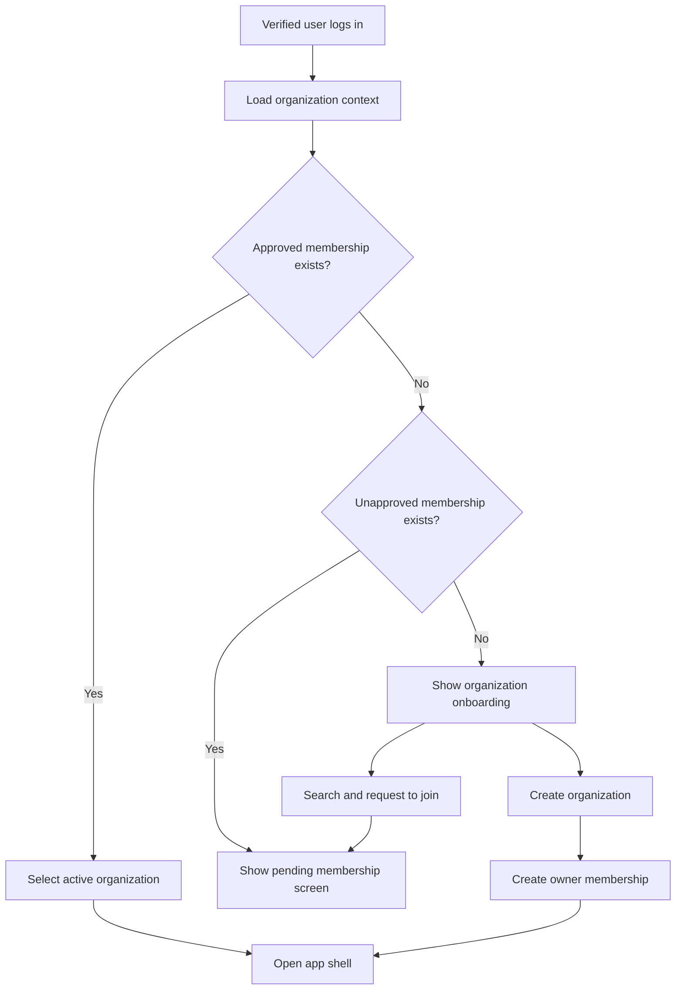
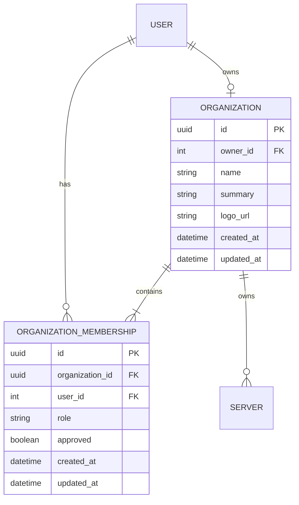

# Role-Based Organization Authentication and Multi-Tenancy

## 1. Purpose

This document is the v1 architecture and implementation plan for organization onboarding, organization-scoped roles, membership approval, tenant isolation, and mobile navigation for Infra Monitor.

Email registration, OTP verification, login, and JWT issuance remain unchanged. Organization onboarding begins after an authenticated user has verified their email.

The design supports:

- users belonging to multiple organizations;
- exactly one active organization at a time;
- exactly one owner per organization;
- multiple organizations owned by an account;
- organization-scoped `OWNER`, `ADMIN`, and `ENGINEER` roles;
- approval-based organization membership using an `approved` flag; and
- strict isolation of infrastructure data between organizations.

The design deliberately keeps authentication separate from organization authorization. A JWT identifies a user; the current membership in the organization URL determines access. This avoids token refreshes whenever a role changes and allows one user to have different roles in different organizations.

The v1 product terminology is **Super admin**, **Admin**, and **Engineer**. In the database and API, the first role is named `OWNER`: it is the immutable creator/owner role and is the only role allowed to manage admins. The UI may display `OWNER` as “Super admin” without introducing a second role.

Ownership transfer, organization deletion, invitation links, and self-service leaving are outside v1. Search plus an approval request is the first join mechanism. A later invitation-link feature should create the same pending membership through a tokenized, expiring flow rather than bypassing membership checks.

## 2. Terminology

| Term | Meaning |
| --- | --- |
| Owner / Super admin | The account that created an organization. There is exactly one per organization and it cannot be managed by normal membership endpoints. |
| Admin | A member appointed by the owner who can approve or reject pending memberships and remove engineers. |
| Engineer | A regular approved member with operational access but no organization administration access. |
| Membership | The approved relationship between a user and an organization, including the user's role. |
| Pending membership | An `ENGINEER` organization membership whose `approved` field is `false`; the row is also the join request in v1. |
| Active organization | The organization whose infrastructure and operational data the application currently displays. |

## 3. User Flows

### 3.1 First-time organization onboarding

After email verification and login, the client loads the authenticated user's organization context.



The onboarding screen provides two actions:

1. **Create organization**
2. **Join existing organization**

An authenticated user without an approved membership must not enter the app shell. Public authentication screens remain available only according to the existing authentication routing rules.

### 3.2 Create an organization

The user provides, at minimum:

- organization name;
- short summary; and
- optional logo URL or uploaded-logo reference.

Creation must be atomic:

1. Create the organization.
2. Create the user's membership with role `OWNER`.
3. Return the organization and membership as the new active context.

If any step fails, neither the organization nor membership is retained.

Users may create additional organizations later from **More**, even if they already own or belong to other organizations.

### 3.3 Join an organization

Only authenticated, email-verified users may search for organizations. Search results expose:

- organization ID;
- name;
- short summary; and
- logo.

Search must not expose owners, members, pending memberships, servers, incidents, metrics, logs, or other tenant data.

After selecting an organization, the system creates an `ENGINEER` membership with `approved=false`. Approval changes that same membership to `approved=true`. Users may have pending memberships in different organizations, but the unique user/organization membership constraint permits only one membership per organization.

### 3.4 Pending memberships and rejection

A user with no approved memberships remains outside the app shell while a membership has `approved=false`. The pending screen displays the organization and submission time.

When a pending membership is:

- **approved**, its `approved` field becomes `true` and the organization becomes active if the user has no active organization;
- **rejected**, the unapproved membership is deleted and the user returns to organization onboarding; or
- **resubmitted**, a new unapproved membership is created after the previous one was rejected and deleted.

A user who already has an approved membership may create and monitor additional unapproved memberships from **More** without losing access to the current organization. Rejection history is retained in the audit log rather than in a separate join-request model.

### 3.5 Multiple organizations

The application operates in exactly one organization context at a time. Users select the active organization through a switcher under **More**.

When the active organization changes, the client must:

1. persist the selected organization ID;
2. clear or invalidate all organization-scoped cached state;
3. reload servers, incidents, analytics, alerts, logs, AI context, and organization-specific preferences; and
4. reject or discard late responses initiated for the previous organization.

If no saved selection remains valid, select the most recently approved membership. If there is only one membership, select it automatically.

## 4. Authorization Model

Roles belong to `OrganizationMembership`, not `Users`. A global role cannot represent different permissions when the same user is an admin in one organization and an engineer in another.

### 4.1 Permission matrix

| Capability | Owner | Admin | Engineer |
| --- | :---: | :---: | :---: |
| View organization operational data | Yes | Yes | Yes |
| Use servers, incidents, analytics, and AI features | Yes | Yes | Yes |
| View pending memberships | Yes | Yes | No |
| Approve or reject pending memberships | Yes | Yes | No |
| Remove engineers | Yes | Yes | No |
| Promote engineer to admin | Yes | No | No |
| Demote admin to engineer | Yes | No | No |
| Remove admins | Yes | No | No |
| Manage or remove owner | No | No | No |
| Transfer ownership | Deferred | No | No |
| Delete organization | Deferred | No | No |

Operational write permissions should follow existing feature-level authorization. Organization roles provide the tenant boundary and organization-administration permissions; they do not replace finer permissions that may be introduced later.

### 4.2 Enforcement rules

- Every organization-scoped request must authenticate the user and load a current membership from the database.
- The organization ID must come from the URL, not from an unrestricted request-body field.
- JWTs identify the user but must not be treated as the source of organization role truth. Roles can change before a JWT expires.
- Querysets must be filtered by both organization and membership before retrieving an object.
- Object lookup by an unscoped primary key followed by a permission check is prohibited because it increases cross-tenant disclosure risk.
- A removed or demoted member receives the new authorization result on their next API request without requiring token rotation.
- Django staff or superuser status does not implicitly grant tenant access through application APIs unless an explicit platform-administration policy is added later.

## 5. Data Model

UUID primary keys are preferred for new externally referenced organization records. Names are searchable display values and must never be used as authorization identifiers.

### 5.1 Organization

| Field | Type | Rules |
| --- | --- | --- |
| `id` | UUID, primary key | Generated by server |
| `name` | string | Required; indexed for case-insensitive search |
| `summary` | string/text | Required; length-limited |
| `logo_url` | URL/string, nullable | Public organization-search metadata only |
| `owner` | Derived from the unique `OWNER` membership | Required logically; not stored directly |
| `created_at` | datetime | Server generated |
| `updated_at` | datetime | Server managed |

Each organization has exactly one owner, while an account may own multiple organizations.

Organization names do not need to be globally unique. The UI uses the summary and logo for disambiguation, while all API operations use the UUID.

### 5.2 OrganizationMembership

| Field | Type | Rules |
| --- | --- | --- |
| `id` | UUID, primary key | Generated by server |
| `organization` | foreign key | Required; cascade on organization deletion when deletion is introduced |
| `user` | foreign key | Required; cascade on user deletion |
| `role` | enum | `OWNER`, `ADMIN`, or `ENGINEER` |
| `approved` | boolean | `false` for a pending engineer; `true` for an active member |
| `created_at` | datetime | Server generated |
| `updated_at` | datetime | Server managed |

Constraints:

- unique `(organization, user)`;
- one `OWNER` membership per organization using a conditional unique constraint;
- an `OWNER` membership's user must equal `organization.owner`; and
- `OWNER` and `ADMIN` memberships must always have `approved=true`; and
- owner membership creation and ownership assignment occur in one transaction.

The `Users` model exposes organizations through a many-to-many relation using this model as the explicit through table. Application access and active-organization selection consider only memberships where `approved=true`.

The existing `Users.role` field must be deprecated. During compatibility migration it may remain readable, but new authorization code must ignore it. Remove it only after every consumer has migrated to membership roles.

### 5.3 Membership approval lifecycle

There is no separate join-request model. The membership row is the request and its `approved` boolean is the complete approval state:

- joining creates `role=ENGINEER, approved=false`;
- approval updates `approved` to `true`;
- rejection deletes the unapproved membership; and
- reapplication creates a new unapproved membership.

Approval must run transactionally and lock the membership row. It verifies reviewer permissions, confirms `approved=false`, and changes it to `true`. Rejection similarly locks and deletes only an unapproved membership. The audit subsystem records the actor and outcome before the transaction completes. Concurrent decisions must return a conflict rather than approve or reject an already-processed membership.

### 5.4 Server ownership

Add a required `organization` foreign key to `Servers`:

```text
Organization 1 ─── * Server
```

One organization may have multiple servers; a server belongs to exactly one organization. Services and metrics inherit their tenant boundary through their server or another already-scoped parent. `Alert`, `Incident`, `LogEntry`, and `AnomalyDetection` currently allow a null server, so each nullable model must receive a direct immutable `organization` foreign key before its API is made organization-scoped. A null server must never mean public or global data.

Records with nullable server relationships must retain enough organization linkage to prevent losing their tenant boundary. Before implementation, each such model must be audited; where records can outlive or exist without a server, add a direct immutable organization foreign key rather than infer tenant ownership from a null relationship.

### 5.5 Operational ownership and assignment

Incidents and other problem records are created inside the active organization. The backend derives `organization` from the scoped URL and validates that referenced servers, services, evidence, and assignees belong to the same organization. An assignee must have an approved membership in that organization. The existing `Incident.assigned_to` relation can be retained; every read and write must validate it through organization membership.

The v1 incident workflow is:

1. An owner, admin, or engineer views an organization-scoped problem.
2. An owner or admin assigns it to an approved engineer, or clears the assignment.
3. The assignee updates status and adds resolution feedback using the incident domain API.
4. Members with operational access can view the status and feedback.

Assignment is an incident capability, not a new organization role. Keep status, assignee, and feedback fields in the incident domain; add only the organization foreign key needed for tenant isolation. Record assignment and resolution changes in the audit trail.

### 5.6 Relationship diagram



## 6. API Contract

All endpoints require JWT authentication unless stated otherwise. UUID values shown as `{organization_id}` and `{membership_id}` are canonical identifiers.

### 6.1 Organization context and discovery

| Method | Endpoint | Permission | Purpose |
| --- | --- | --- | --- |
| `GET` | `/api/organizations/context/` | Authenticated | Return approved and pending memberships, owned-organization eligibility, and recommended active organization |
| `GET` | `/api/organizations/search/?q=` | Authenticated + verified | Search public organization metadata |
| `POST` | `/api/organizations/` | Authenticated + verified | Create organization and owner membership |
| `GET` | `/api/organizations/{organization_id}/` | Member | Return organization details visible to members |

The context response is the source of truth for routing after login and app restoration. A representative response is:

```json
{
  "memberships": [
    {
      "organization": {
        "id": "8ed2d642-3db5-47b2-8b7d-b965f5d4da11",
        "name": "Example Operations",
        "summary": "Production infrastructure team",
        "logo_url": null
      },
      "role": "ENGINEER",
      "approved": true,
      "created_at": "2026-08-22T12:00:00Z"
    }
  ],
  "pending_memberships": [],
  "can_create_organization": true,
  "recommended_organization_id": "8ed2d642-3db5-47b2-8b7d-b965f5d4da11"
}
```

The server recommends an active organization but does not need to store UI selection in v1. The client persists the explicit selection locally and verifies it against the latest memberships during startup.

### 6.2 Membership requests and approval

| Method | Endpoint | Permission | Purpose |
| --- | --- | --- | --- |
| `POST` | `/api/organizations/{organization_id}/memberships/` | Authenticated non-member | Create an unapproved engineer membership |
| `GET` | `/api/organizations/{organization_id}/memberships/?approved=false` | Owner or admin | List pending memberships |
| `POST` | `/api/organizations/{organization_id}/memberships/{membership_id}/approve/` | Owner or admin | Set the membership's `approved` field to `true` |
| `DELETE` | `/api/organizations/{organization_id}/memberships/{membership_id}/reject/` | Owner or admin | Reject by deleting the unapproved membership |

Creating a pending membership returns `201 Created`. Approval returns `200 OK` with the updated membership. Repeated or stale decisions return `409 Conflict`. Attempts involving a membership from another organization return `404 Not Found`, avoiding cross-tenant disclosure.

### 6.3 Membership administration

| Method | Endpoint | Permission | Purpose |
| --- | --- | --- | --- |
| `GET` | `/api/organizations/{organization_id}/members/` | Member | List organization members and roles |
| `PATCH` | `/api/organizations/{organization_id}/members/{user_id}/role/` | Owner | Change `ADMIN`/`ENGINEER` role |
| `DELETE` | `/api/organizations/{organization_id}/members/{user_id}/` | Owner, or admin targeting engineer | Remove membership |

Role-change rules:

- the endpoint accepts only `ADMIN` or `ENGINEER`;
- the owner role cannot be assigned, removed, or changed through this endpoint;
- admins cannot call the role endpoint;
- admins may delete only engineer memberships; and
- users cannot remove themselves in v1 unless a separate leave-organization flow is specified later.

### 6.4 Tenant-scoped operational APIs

All operational resources must be addressed beneath the organization context or otherwise receive an organization ID through a centrally enforced scoped interface. The preferred v1 form is:

```text
/api/organizations/{organization_id}/servers/
/api/organizations/{organization_id}/incidents/
/api/organizations/{organization_id}/alerts/
/api/organizations/{organization_id}/analytics/
/api/organizations/{organization_id}/ai/...
```

Existing unscoped endpoints must be migrated or wrapped so they cannot return data without an organization membership check. Clients must not send an arbitrary `organization_id` when creating child records; the server derives it from the scoped URL and authenticated membership.

### 6.5 Incident workflow APIs

| Method | Endpoint | Permission | Purpose |
| --- | --- | --- | --- |
| `PATCH` | `/api/organizations/{organization_id}/incidents/{incident_id}/assignment/` | Owner or admin | Assign an approved organization engineer or clear the assignee |
| `PATCH` | `/api/organizations/{organization_id}/incidents/{incident_id}/status/` | Assigned engineer, owner, or admin | Change the incident status |
| `POST` | `/api/organizations/{organization_id}/incidents/{incident_id}/feedback/` | Assigned engineer, owner, or admin | Add resolution or investigation feedback |

The incident domain owns the exact status vocabulary and transition rules. Assignment and feedback endpoints must retrieve incidents through organization-filtered querysets and must reject an assignee from another organization.

### 6.6 Standard errors

| Status | Meaning |
| --- | --- |
| `400` | Invalid input or invalid state transition |
| `401` | Missing or invalid JWT |
| `403` | Authenticated member lacks the required role |
| `404` | Organization-scoped object is absent or outside the caller's organization |
| `409` | Duplicate membership or already-processed membership decision |

## 7. Backend Architecture

Create a dedicated organization domain/app rather than placing organization behavior in generic account views. It owns the organization and membership models, serializers, services, permission classes, endpoints, and tests.

Use service-layer transactions for:

- organization plus owner-membership creation;
- membership approval and rejection;
- role changes; and
- membership removal.

Reusable permission and queryset components must provide:

- membership resolution from `organization_id`;
- minimum-role checks;
- owner-only checks; and
- organization-filtered object retrieval.

Do not duplicate role-ranking logic across views. Explicit capabilities are preferable to assuming `OWNER > ADMIN > ENGINEER` for every operation, because admins have deliberately limited member-management powers.

### 7.1 Recommended implementation order

Implement the feature in vertical slices so the existing auth flow remains deployable:

1. **Organization foundation:** add the organization app, models, constraints, migrations, and service tests. Keep `Users.role` unchanged.
2. **Context and onboarding:** add context, create, search, join, approval, and membership-management APIs, then add Flutter routing for the tested context states.
3. **Tenant anchor:** add `Servers.organization`, run the controlled legacy backfill, and make it required. Audit nullable problem records and add direct organization links where required.
4. **Scoped reads:** migrate list/detail querysets to organization-scoped access, starting with servers and incidents. Unassigned legacy rows remain inaccessible.
5. **Scoped writes and workflow:** derive tenant ownership from URL context, validate same-organization references, then add assignment, status, and feedback operations.
6. **Client isolation:** add the organization switcher, scoped provider/cache keys, and late-response protection.
7. **Compatibility cleanup:** remove authorization reads of `Users.role`; remove the field only in a later release after all consumers have migrated.

Each slice ships with model/service tests and API isolation tests before the next slice starts. This keeps rollback boundaries clear and avoids a simultaneous auth, schema, and client rewrite.

## 8. Flutter Navigation and State

### 8.1 Authentication and organization states

Authentication remains responsible for tokens and the authenticated user. Add a separate organization-context state with at least:

- `initial/loading`;
- `needsOnboarding`;
- `pendingOnly`;
- `ready` with memberships and active organization; and
- `error`.

The router waits for both authentication restoration and organization-context loading before redirecting.

Routing behavior:

| Authentication | Organization context | Destination |
| --- | --- | --- |
| Unauthenticated | Any | Login |
| Authenticated | No membership | Organization onboarding |
| Authenticated | Unapproved memberships only | Pending screen |
| Authenticated | At least one approved membership | App shell |

### 8.2 More tab

The existing More tab becomes the entry point for:

- active-organization switcher;
- organization profile summary;
- create organization, when eligible;
- search/join another organization;
- pending-membership status;
- member list; and
- organization administration for owner/admin roles.

Visibility rules:

- engineers see organization context and membership information but no administration controls;
- admins see pending memberships and may approve, reject, and remove engineers; and
- owners additionally see role promotion/demotion and admin removal controls.

Client-side visibility improves UX but is not a security boundary. Every action remains protected by backend authorization.

### 8.3 Provider and cache isolation

Every organization-scoped repository/provider cache key must include the organization ID. Switching organization must invalidate the old scope before rendering new data.

Async requests should capture the organization ID at dispatch and verify it is still active before publishing results. This prevents a slow response from organization A from appearing after switching to organization B.

AI conversations and prompts must include only incidents, logs, and evidence from the active organization. Conversation history must also be scoped by organization, directly or through a guaranteed scoped parent.

## 9. Migration Strategy

Tenant introduction must be staged so existing server rows never become ambiguously accessible.

1. Add organization models and membership roles without removing `Users.role`.
2. Add nullable `Servers.organization` and deploy code capable of reading the new field without exposing unassigned rows.
3. Provide a data-migration command requiring `LEGACY_ORG_OWNER_EMAIL`:
   - locate the designated existing verified user;
   - create or locate a single **Legacy Organization** owned by that user;
   - create its owner membership; and
   - assign every unassigned existing server to it.
4. Audit and backfill organization ownership for records that can survive without a server.
5. Verify that no tenant-owned records remain unassigned.
6. Make `Servers.organization` and any required direct organization fields non-null.
7. migrate all API and Flutter consumers away from global `Users.role`;
8. remove `Users.role` in a later compatibility release.

The migration command must abort if the owner email is missing, ambiguous, unverified, or cannot safely own the legacy organization. It must be idempotent and report counts before and after assignment.

Until backfill completes, unassigned servers must be inaccessible through application APIs rather than treated as globally visible.

## 10. Security and Audit Requirements

- Log organization creation, membership approval/rejection, promotions, demotions, and membership removals with actor, target, organization, action, and timestamp.
- Never include secrets, JWTs, OTPs, server credentials, or OAuth credentials in audit events.
- Apply throttling to organization search and unapproved-membership creation.
- Escape search input and use bounded, paginated results.
- Return generic not-found responses for cross-organization object IDs.
- Recheck authorization inside write transactions to prevent time-of-check/time-of-use races.
- Prevent removal or modification of the owner membership through general membership endpoints.
- Do not allow organization ownership to become null when a user is deleted; owner deletion requires a future explicit ownership/deletion workflow.

## 11. Testing Strategy

### 11.1 Backend model and service tests

- An account can own multiple organizations.
- An organization cannot have two owner memberships.
- Owner and owner membership always refer to the same user.
- A user can hold different roles in different organizations.
- Duplicate memberships are rejected.
- The unique membership constraint prevents duplicate pending or approved memberships per user/organization.
- Rejected users can create a new unapproved membership.
- Approval creates exactly one engineer membership under concurrent calls.
- Approved memberships cannot be rejected through the pending-membership endpoint.
- Legacy backfill is safe and idempotent.

### 11.2 API authorization tests

- Unauthenticated users cannot use organization endpoints.
- Users without membership cannot access the app's operational APIs.
- Engineers cannot list or decide pending memberships.
- Admins can approve/reject pending memberships and remove engineers.
- Admins cannot promote, demote, or remove admins or the owner.
- Owners can promote/demote members and remove non-owner members.
- No role can modify or remove the owner through v1 endpoints.
- A member of organization A cannot enumerate or access organization B resources, even with known UUIDs.
- Removed members lose access on their next request with an otherwise valid JWT.
- Search exposes only approved public metadata.

### 11.3 Flutter tests

- Authenticated users without memberships are routed to onboarding.
- Pending-only users remain on the pending screen.
- Rejected users return to organization search and can reapply.
- Approved users enter the app shell after context refresh.
- Role-specific controls in More match the active membership.
- Switching organizations invalidates and reloads scoped providers.
- Late responses from the previous organization are discarded.
- A locally stored organization ID that is no longer authorized falls back safely.

### 11.4 End-to-end acceptance scenarios

1. A verified user creates an organization, becomes its owner, and enters an empty organization-scoped app shell.
2. Another user finds that organization, submits a request, and remains outside the shell while pending.
3. The owner approves the request; the user refreshes context, becomes an engineer, and enters the shell.
4. The owner promotes the engineer to admin; the new admin can approve another engineer but cannot promote that engineer.
5. An admin removes an engineer; the removed account immediately loses access to that organization's APIs.
6. A rejected applicant reapplies and can subsequently be approved.
7. A multi-organization user switches context without seeing cached or live data from the previous organization.

## 12. Completion Criteria

The feature is complete when:

- organization onboarding gates the current app shell;
- all operational data access is scoped to a verified membership and organization ID;
- owner, admin, and engineer permissions match the matrix;
- unapproved memberships support approval, rejection by deletion, and reapplication;
- the active-organization switcher safely reloads all tenant state;
- existing servers are assigned through the controlled legacy migration;
- the global user role is no longer used for authorization; and
- backend, Flutter, and end-to-end isolation tests pass.
