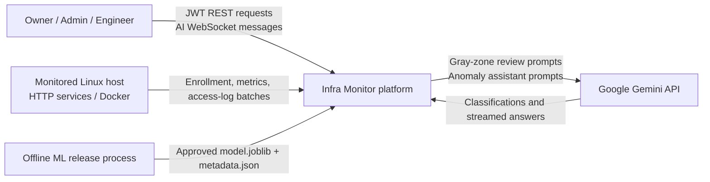
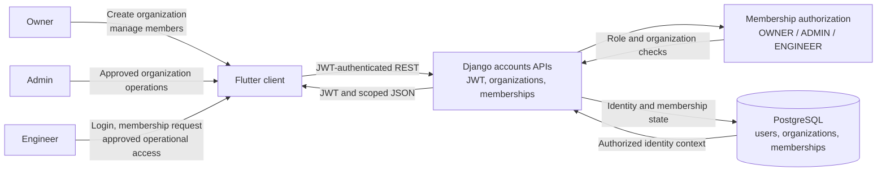
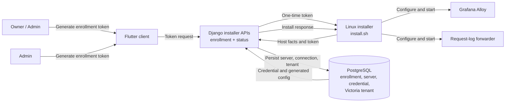
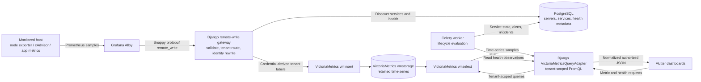
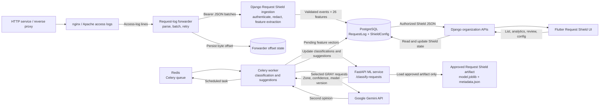
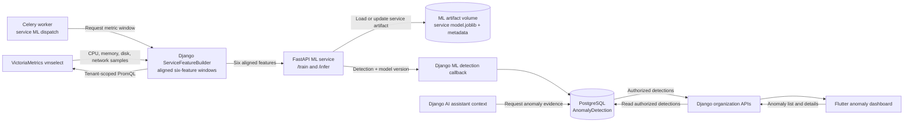

# Infra Monitor Data Flow Diagram

This document describes the current deployed architecture and the movement of
control-plane data, telemetry, logs, machine-learning data, and AI messages.

The diagram follows the implementation in `docker-compose.yml`, Django root
routing, the installer, the ML service, and the Flutter data sources. PostgreSQL
stores application and request-event state. VictoriaMetrics stores numeric
time-series samples and is queried through Django; the Flutter client does not
connect to VictoriaMetrics directly.

## Level 0: System Context



## Modeling Approach

The primary decomposition is by feature/data plane because each feature has a
different source, processing path, and persistence boundary. Human roles are
shown where they initiate or authorize a flow:

- **Owner** creates organizations, manages memberships, and controls privileged
  monitoring configuration.
- **Admin** manages approved organization operations and monitoring workflows.
- **Engineer** requests membership and uses approved operational data.
- **System actors** such as host collectors, Celery, the ML service, and Gemini
  carry data between services without being organization members.

Feature-based chunks are clearer than one role-only diagram because metrics,
access logs, asynchronous jobs, and model releases are primarily system-driven.

## Feature DFD 1: Identity and Organization Access



## Feature DFD 2: Enrollment and Collector Provisioning



## Feature DFD 3: Metrics and Service Health



## Feature DFD 4: Access Logs and Request Shield



## Feature DFD 5: Service Anomaly Detection




## Feature DFD 6: AI Assistant

```mermaid
flowchart LR
    User["Owner / Admin / Engineer"]
    Flutter["Flutter AI assistant"]
    Ticket["Django WebSocket ticket API"]
    Consumer["Django Channels consumer"]
    PG[("PostgreSQL\nconversations, messages,\nanomaly evidence")]
    Gemini["Google Gemini API"]

    User -->|"Ask question"| Flutter
    Flutter -->|"Request one-time WebSocket ticket"| Ticket
    Ticket -->|"Ticket state"| PG
    Flutter -->|"Conversation WebSocket"| Consumer
    Consumer -->|"History and authorized evidence"| PG
    Consumer -->|"Prompt and stream request"| Gemini
    Gemini -->|"Streamed answer"| Consumer
    Consumer -->|"Stream tokens"| Flutter
    Consumer -->|"Persist completed response"| PG
  ```


## Data Store Responsibilities

| Store              | Data                                                                                                                                                                              | Main writers                                                                    | Main readers                                               |
| ------------------ | --------------------------------------------------------------------------------------------------------------------------------------------------------------------------------- | ------------------------------------------------------------------------------- | ---------------------------------------------------------- |
| PostgreSQL         | Identity, organizations, enrollment, server/service metadata, credentials, alerts, incidents, logs, anomaly detections, AI state, Request Shield events/configuration/suggestions | Django APIs, remote-write gateway metadata path, Celery worker, ML callback     | Django domain APIs, Celery worker, Flutter through Django  |
| VictoriaMetrics    | Prometheus numeric samples and labels, including host, container, and application metrics                                                                                         | Django remote-write gateway through`vminsert`                                 | Django`VictoriaMetricsQueryAdapter` through `vmselect` |
| Redis              | Celery task messages and results                                                                                                                                                  | Celery Beat, Django task dispatch                                               | Celery Worker and result consumers                         |
| ML artifact volume | Versioned model files and metadata                                                                                                                                                | Offline release/deployment process; service anomaly training path where enabled | FastAPI ML service                                         |
| Forwarder state    | Access-log byte offset                                                                                                                                                            | Request-log forwarder                                                           | Request-log forwarder after restart/rotation               |

## Important Boundaries

- Flutter never calls FastAPI, PostgreSQL, Redis, or VictoriaMetrics directly.
  Django authorizes and normalizes all client-facing data.
- Monitoring credentials identify the organization and server. Collector-sent
  identity labels are overwritten before samples are sent to VictoriaMetrics.
- Metrics are time-series data and belong in VictoriaMetrics. Request Shield
  access events remain in PostgreSQL because they need paths, event metadata,
  classification updates, deduplication, review state, and relational tenancy.
- Request Shield production performs inference only. Its approved
  `model.joblib` and `metadata.json` are released offline; the production ML
  service does not expose a Request Shield training endpoint.
- Gemini is backend-only. API keys and prompts are not sent to Flutter.
- The current generic service-anomaly path still has `/train` and `/infer`
  semantics for service models; that is separate from the artifact-only Request
  Shield classifier.
