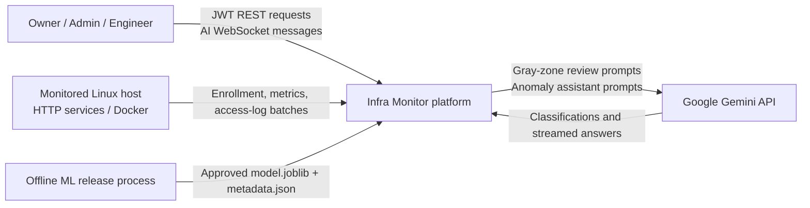
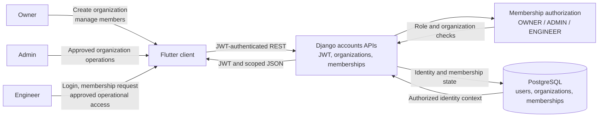
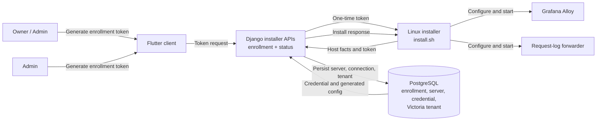
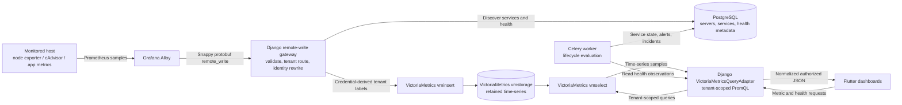
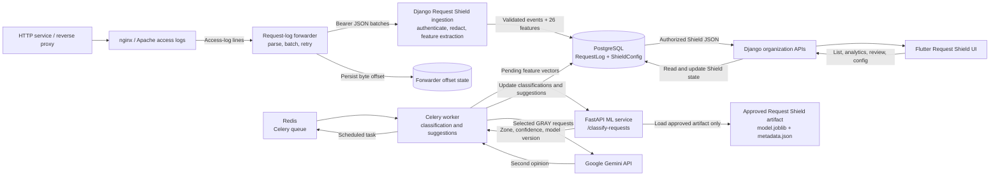
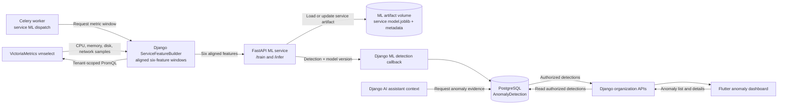
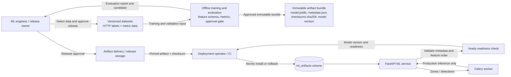

# Infra Monitor Data Flow Diagram

This document describes the current deployed architecture and the movement of
control-plane data, telemetry, logs, machine-learning data, and AI messages.

The diagram follows the implementation in `docker-compose.yml`, Django root
routing, the installer, the ML service, and the Flutter data sources. PostgreSQL
stores application and request-event state. VictoriaMetrics stores numeric
time-series samples and is queried through Django; the Flutter client does not
connect to VictoriaMetrics directly.

## Level 0: System Context



## Modeling Approach

The primary decomposition is by feature/data plane because each feature has a
different source, processing path, and persistence boundary. Human roles are
shown where they initiate or authorize a flow:

- **Owner** creates organizations, manages memberships, and controls privileged
  monitoring configuration.
- **Admin** manages approved organization operations and monitoring workflows.
- **Engineer** requests membership and uses approved operational data.
- **System actors** such as host collectors, Celery, the ML service, and Gemini
  carry data between services without being organization members.

Feature-based chunks are clearer than one role-only diagram because metrics,
access logs, asynchronous jobs, and model releases are primarily system-driven.

## Feature DFD 1: Identity and Organization Access



## Feature DFD 2: Enrollment and Collector Provisioning



## Feature DFD 3: Metrics and Service Health



## Feature DFD 4: Access Logs and Request Shield



## Feature DFD 5: Service Anomaly Detection



## Feature DFD 6: Offline ML Release and Deployment



The offline release process is separate from production request processing.
Request Shield production does not train or replace artifacts over HTTP. The
generic service-anomaly path may still use its separately controlled `/train`
and `/infer` workflow; that is not the Request Shield release path.

## Feature DFD 7: AI Assistant

```mermaid
flowchart LR
    User["Owner / Admin / Engineer"]
    Flutter["Flutter AI assistant"]
    Ticket["Django WebSocket ticket API"]
    Consumer["Django Channels consumer"]
    PG[("PostgreSQL\nconversations, messages,\nanomaly evidence")]
    Gemini["Google Gemini API"]

    User -->|"Ask question"| Flutter
    Flutter -->|"Request one-time WebSocket ticket"| Ticket
    Ticket -->|"Ticket state"| PG
    Flutter -->|"Conversation WebSocket"| Consumer
    Consumer -->|"History and authorized evidence"| PG
    Consumer -->|"Prompt and stream request"| Gemini
    Gemini -->|"Streamed answer"| Consumer
    Consumer -->|"Stream tokens"| Flutter
    Consumer -->|"Persist completed response"| PG
  ```

## Level 1: Complete Data Flow

```mermaid
flowchart TB
    %% External actors and host-side producers
    subgraph EXT[External actors and monitored environments]
        Flutter["Flutter client\nREST + WebSocket"]
        Installer["Downloaded host installer\nDebian / Ubuntu"]
        Host["Monitored Linux host"]
        HttpSvc["HTTP services / reverse proxy"]
        Docker["Docker containers\noptional"]
        AccessFiles["nginx / Apache access logs"]
        Gemini["Google Gemini API"]
        Release["Offline model release\ntraining + evaluation"]
    end

    %% Host collectors
    subgraph COLLECT[Host collection layer]
        Alloy["Grafana Alloy\nnode exporter / cAdvisor / app metrics"]
        Forwarder["Request-log forwarder\nparser, batching, offset state"]
        Credential["/etc/alloy/credential"]
        Offset["Forwarder offset state\n/var/lib/infra-monitor"]
    end

    %% Application boundary
    subgraph DJANGO[Django backend: API and domain services]
        Auth["Accounts and organization APIs\nJWT, memberships, enrollment"]
        InstallAPI["Installer / monitoring APIs\nenrollment, status, remote write"]
        MetricsGW["Prometheus remote-write gateway\nvalidate, tenant route, identity rewrite"]
        OrgAPI["Organization operational APIs\ndashboard, servers, alerts, incidents, logs"]
        RequestIn["Request-log ingestion API\nauthenticate, validate, feature extraction"]
        LogIn["Internal log batch API"]
        MLCallback["ML detection callback API"]
        Health["Health and readiness APIs"]
        QueryAdapter["VictoriaMetrics query adapter\ntenant-scoped PromQL"]
        Lifecycle["Service lifecycle evaluator\nhealth state, alerts, incidents"]
        Shield["Request Shield services\nclassification, suggestions, review"]
        AIConsumer["Django Channels / AI consumer\nWebSocket ticket and streaming"]
        Domains["Domain services\naccounts, servers, dashboard, alert,\nincident, log, ml_model, sanitize, ai"]
    end

    %% Async layer
    subgraph ASYNC[Asynchronous processing]
        Beat["Celery Beat\nperiodic schedules"]
        Redis["Redis\nCelery broker + result backend"]
        Worker["Celery Worker\nmonitoring, ML, logs, Request Shield"]
        Tasks["Scheduled tasks\nlifecycle, service ML, Shield classify,\nGemini escalation, suggestions"]
    end

    %% Persistence
    subgraph PGDATA[PostgreSQL: control-plane and event data]
        PG["PostgreSQL"]
        PGEntities["Users, organizations, memberships\nEnrollment tokens and installer state\nServers, services, credentials\nAlerts, incidents, logs\nAnomaly detections\nAI conversations, messages, tickets\nRequest logs, ShieldConfig, suggestions"]
    end

    %% Metrics storage
    subgraph VMDATA[VictoriaMetrics: numeric time-series data]
        VMInsert["vminsert\ntenant write gateway"]
        VMStorage["vmstorage\nretained metric samples"]
        VMSelect["vmselect\nPromQL query gateway"]
    end

    %% ML services and artifacts
    subgraph MLBOUND[FastAPI ML service]
        MLAPI["/health /ready\n/train /infer /classify-requests"]
        AnomalyModel["Service anomaly models\n/code/artifacts/<service_id>/"]
        ShieldModel["Approved Request Shield artifact\nrequest_shield/model.joblib\nmetadata.json"]
    end

    %% Enrollment and installation
    Flutter -->|"Create enrollment token\norganization/admin data"| Auth
    Auth -->|"Users, orgs, memberships, token"| PG
    Installer -->|"Download install.sh"| InstallAPI
    Installer -->|"One-time token, host facts"| InstallAPI
    InstallAPI -->|"Server, connection, credential,\nVictoria tenant, Alloy config"| PG
    InstallAPI -->|"Generated config + credential"| Installer
    Installer -->|"Install and start"| Alloy
    Installer -->|"Install and start"| Forwarder
    Credential -->|"Bearer credential"| Alloy
    Credential -->|"Bearer credential"| Forwarder
    AccessFiles -->|"Combined access-log lines"| Forwarder
    Forwarder -->|"Persist read offset"| Offset
    HttpSvc -->|"Produces access logs"| AccessFiles
    Docker -->|"Container metrics / app metrics"| Alloy

    %% Metrics ingestion and querying
    Alloy -->|"Snappy protobuf Prometheus remote_write"| MetricsGW
    MetricsGW -->|"Discover services; update health metadata"| PG
    MetricsGW -->|"Replace untrusted labels with\ncredential-derived tenant identity"| VMInsert
    VMInsert -->|"Tenant-isolated time-series samples"| VMStorage
    VMStorage --> VMSelect
    Flutter -->|"Dashboard/server metric requests"| OrgAPI
    OrgAPI --> QueryAdapter
    QueryAdapter -->|"Tenant-scoped PromQL"| VMSelect
    VMSelect -->|"Range/latest samples"| QueryAdapter
    QueryAdapter -->|"Normalized authorized JSON"| OrgAPI
    OrgAPI -->|"Dashboards, servers, metrics, alerts,\nincidents, logs, anomalies, Shield"| Flutter

    %% Event and control-plane APIs
    Forwarder -->|"Bearer JSON access-log batches"| RequestIn
    RequestIn -->|"Validated RequestLog rows + feature vectors"| PG
    Host -->|"Internal operational log batches"| LogIn
    LogIn -->|"Log records"| PG
    MLCallback -->|"Detection result + model version"| PG
    Domains -->|"Domain reads and writes"| PG
    PG -->|"Authorized domain data"| Domains
    Auth --> Domains
    OrgAPI --> Domains
    Health -->|"DB, Redis, Victoria, ML checks"| PG
    Health -->|"Telemetry health"| QueryAdapter

    %% Async orchestration
    Beat -->|"Periodic task messages"| Redis
    Redis -->|"Queued tasks"| Worker
    Worker --> Tasks
    Tasks -->|"Lifecycle state and alert/incident changes"| Lifecycle
    Lifecycle -->|"Read metric health / up observations"| QueryAdapter
    Lifecycle -->|"Update service status, alerts, incidents"| PG

    %% Service anomaly ML flow
    Worker -->|"Build six-feature windows"| QueryAdapter
    Worker -->|"Authorized /train or /infer requests"| MLAPI
    MLAPI -->|"Load or atomically update"| AnomalyModel
    MLAPI -->|"Callback for detection"| MLCallback

    %% Request Shield ML flow
    Worker -->|"Pending 26-feature request vectors"| Shield
    Shield -->|"POST /classify-requests\nfeature names + vectors"| MLAPI
    MLAPI -->|"Load approved artifact only"| ShieldModel
    MLAPI -->|"Zones, confidence, model version"| Shield
    Shield -->|"Update RequestLog classification"| PG
    Shield -->|"Threat suggestions and review state"| PG
    Shield -->|"Gray-zone requests"| Gemini
    Gemini -->|"Second-opinion zone and reason"| Shield

    %% AI assistant flow
    Flutter -->|"Obtain one-time WebSocket ticket"| AIConsumer
    Flutter -->|"Assistant conversation messages"| AIConsumer
    AIConsumer -->|"Conversation history + anomaly evidence"| PG
    AIConsumer -->|"Prompt / streamed completion"| Gemini
    Gemini -->|"Streamed answer"| AIConsumer
    AIConsumer -->|"Stream tokens; persist completed message"| Flutter
    AIConsumer -->|"Messages, tickets, assistant metadata"| PG

    %% Offline artifact deployment
    Release -->|"Approved immutable artifacts"| ShieldModel
    Release -->|"Approved service anomaly artifacts"| AnomalyModel
```

## Data Store Responsibilities

| Store              | Data                                                                                                                                                                              | Main writers                                                                    | Main readers                                               |
| ------------------ | --------------------------------------------------------------------------------------------------------------------------------------------------------------------------------- | ------------------------------------------------------------------------------- | ---------------------------------------------------------- |
| PostgreSQL         | Identity, organizations, enrollment, server/service metadata, credentials, alerts, incidents, logs, anomaly detections, AI state, Request Shield events/configuration/suggestions | Django APIs, remote-write gateway metadata path, Celery worker, ML callback     | Django domain APIs, Celery worker, Flutter through Django  |
| VictoriaMetrics    | Prometheus numeric samples and labels, including host, container, and application metrics                                                                                         | Django remote-write gateway through`vminsert`                                 | Django`VictoriaMetricsQueryAdapter` through `vmselect` |
| Redis              | Celery task messages and results                                                                                                                                                  | Celery Beat, Django task dispatch                                               | Celery Worker and result consumers                         |
| ML artifact volume | Versioned model files and metadata                                                                                                                                                | Offline release/deployment process; service anomaly training path where enabled | FastAPI ML service                                         |
| Forwarder state    | Access-log byte offset                                                                                                                                                            | Request-log forwarder                                                           | Request-log forwarder after restart/rotation               |

## Important Boundaries

- Flutter never calls FastAPI, PostgreSQL, Redis, or VictoriaMetrics directly.
  Django authorizes and normalizes all client-facing data.
- Monitoring credentials identify the organization and server. Collector-sent
  identity labels are overwritten before samples are sent to VictoriaMetrics.
- Metrics are time-series data and belong in VictoriaMetrics. Request Shield
  access events remain in PostgreSQL because they need paths, event metadata,
  classification updates, deduplication, review state, and relational tenancy.
- Request Shield production performs inference only. Its approved
  `model.joblib` and `metadata.json` are released offline; the production ML
  service does not expose a Request Shield training endpoint.
- Gemini is backend-only. API keys and prompts are not sent to Flutter.
- The current generic service-anomaly path still has `/train` and `/infer`
  semantics for service models; that is separate from the artifact-only Request
  Shield classifier.
