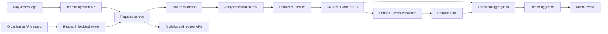

# Request Shield (Sanitize)

Request Shield is Infra-Monitor's HTTP traffic analysis feature. It collects request metadata from monitored servers and, optionally, from the Infra-Monitor API itself. Each request is converted into a fixed feature vector, classified into a threat zone, and exposed to organization administrators for analysis and review.

Request Shield is an analysis and recommendation system. It does not block requests, terminate sessions, or automatically ban IP addresses.

## What the feature does

1. **Traffic ingestion**: accepts batches of parsed access-log entries from a Grafana Alloy agent through an internal, server-authenticated endpoint.
2. **Platform self-monitoring**: records metadata for organization-scoped API requests through Django middleware.
3. **Threat classification**: assigns each request to `GREEN` (safe), `GRAY` (suspicious), or `RED` (malicious/high risk) using the private FastAPI ML service.
4. **Gray-zone escalation**: optionally sends GRAY requests to Gemini for a second decision. Gemini may keep them GRAY, promote them to RED, or downgrade them to GREEN.
5. **Threat suggestions and analytics**: aggregates suspicious requests by IP, creates administrator suggestions after configurable thresholds, and serves dashboard and review endpoints.

## End-to-end flow



The pipeline is asynchronous after a request log is stored. Celery Beat dispatches classification every 30 seconds by default, Gemini escalation every 120 seconds, and suggestion generation every 60 seconds.

## Data sources

### External monitored servers

The Alloy agent sends batches to:

```text
POST /api/internal/request-logs/
```

The endpoint uses `ServerCredentialAuthentication`. The payload contains a `server_id` and request entries. The reported ID must match the authenticated server, otherwise the request is rejected with HTTP 403. Accepted entries are stored with `source=EXTERNAL` and are linked to the organization and monitored server.

### Infra-Monitor API traffic

`sanitize.middleware.RequestShieldMiddleware` runs after Django's `AuthenticationMiddleware`. It captures requests whose paths contain an organization UUID in this form:

```text
/api/organizations/<organization-uuid>/...
```

Health, readiness, static, and favicon paths are skipped. Platform rows use `source=PLATFORM` and `server=NULL`.

The middleware does not capture request bodies. Cookies, authorization headers, and CSRF tokens are excluded from the stored header digest. Retained header values are truncated to 200 characters.

## Feature extraction

`sanitize.features.extract_features` is the source of truth for the model input. It returns 26 numeric values in this order:

| Index | Feature | Meaning |
| ---: | --- | --- |
| 0 | `method_encoded` | HTTP method mapping; unknown methods use 9 |
| 1 | `path_depth` | Number of non-empty path segments |
| 2 | `path_length` | Path length |
| 3 | `path_has_traversal` | `../` or equivalent traversal pattern |
| 4 | `path_has_suspicious_ext` | Sensitive or commonly probed file extensions |
| 5 | `query_param_count` | Count of `=` characters |
| 6 | `query_length` | Query-string length |
| 7 | `query_has_sql_injection` | SQL injection pattern in query |
| 8 | `query_has_xss` | XSS pattern in query |
| 9 | `query_has_cmd_injection` | Command injection pattern in URL |
| 10 | `path_has_sql_injection` | SQL injection pattern in path |
| 11 | `path_has_xss` | XSS pattern in path |
| 12 | `ua_is_known_browser` | Known browser marker |
| 13 | `ua_is_bot` | Scanner, crawler, or automation marker |
| 14 | `ua_is_empty` | Empty or whitespace-only user agent |
| 15 | `ua_length` | User-agent length |
| 16 | `content_length_log` | Log-transformed content length |
| 17 | `has_content_length` | Positive content length exists |
| 18 | `status_code_class` | 2xx through 5xx class, or other |
| 19 | `response_time_log` | Log-transformed response time |
| 20 | `has_referer` | Non-empty referer exists |
| 21 | `protocol_version` | Numeric HTTP protocol version |
| 22 | `header_count` | Number of retained headers |
| 23 | `has_special_chars_in_path` | Suspicious special characters |
| 24 | `path_entropy` | Shannon entropy of path |
| 25 | `query_entropy` | Shannon entropy of query |

In parallel, `extract_threat_signals` produces human-readable codes such as `sql_injection`, `xss`, `command_injection`, `path_traversal`, `suspicious_extension`, `known_scanner_or_bot`, and `empty_user_agent`.

The vector and signals are computed on ingestion and cached in `RequestLog`, so later classification does not need the original access-log parser.

## Classification pipeline

Celery task `sanitize.classify_request_batch` loops through all organizations and processes up to `REQUEST_SHIELD_CLASSIFY_BATCH_SIZE` pending rows per organization. Pending means `zone=UNCLASSIFIED` and a non-null feature vector.

The backend sends the ordered feature names and vectors to:

```text
POST <ML_SERVICE_URL>/classify-requests
Authorization: Bearer <ML_SERVICE_TOKEN>
```

The ML service loads `request_shield/model.joblib`, predicts a zone and probability-based confidence, and returns the model version. Django stores the zone, confidence, classifier, and timestamp. The default model is a balanced Random Forest. The feature order is a compatibility contract shared by extraction, preprocessing, training, and inference.

### Gemini escalation

`sanitize.escalate_gray_requests` selects rows that are GRAY and were classified by the ML model. If `GEMINI_API_KEY` is configured and the organization's `gemini_escalation` setting is enabled, it sends batches of up to 20 requests to Gemini. The prompt includes request metadata and threat signals, not request bodies.

Only valid JSON verdicts with a valid index and zone are accepted. Updated rows are marked as classified by `GEMINI`.

## Threat suggestions

By default, `sanitize.generate_threat_suggestions` runs every minute. It counts requests per source IP in the rolling `ShieldConfig.suggestion_window_minutes` window:

- RED uses `red_suggestion_threshold` (default 5).
- GRAY uses `gray_suggestion_threshold` (default 20).

A suggestion stores the IP, zone, count, window, up to ten sample paths, and the five most common signals. A duplicate PENDING suggestion for the same organization, IP, and zone is not created.

Suggestions are `PENDING`, `ACCEPTED`, or `DISMISSED`. Accepting records administrator acknowledgement only; it does not change firewall rules or block the IP.

## Organization API

Organization endpoints require authenticated membership and are rooted at `/api/organizations/<organization_id>/request-shield/`.

| Endpoint | Purpose |
| --- | --- |
| `GET analytics/` | Zone distribution, top offending IPs, time trend, totals, and pending suggestions |
| `GET requests/` | Paginated logs; filter by `zone`, `source`, `ip`, `method`, or path substring |
| `GET requests/<log_id>/` | Request-log detail |
| `POST requests/<log_id>/verdict/` | Record `confirmed_safe` or `confirmed_threat` |
| `GET suggestions/` | Paginated suggestions; filter by status |
| `POST suggestions/<suggestion_id>/action/` | Accept or dismiss with optional notes |
| `GET config/` | Read organization configuration |
| `PATCH config/` | Update switches and thresholds |

The analytics `hours` parameter is clamped to 1 hour through 30 days. Presenters intentionally omit the cached feature vector from normal read responses.

## Configuration

| Setting | Default | Role |
| --- | --- | --- |
| `ML_SERVICE_URL` | `http://ml_service:80` | Private ML service address |
| `ML_SERVICE_TOKEN` | empty | Shared backend/ML bearer token |
| `ML_REQUEST_TIMEOUT_SECONDS` | `30` | Classification timeout |
| `GEMINI_API_KEY` | empty | Enables Gemini integration when present |
| `GEMINI_MODEL` | `gemini-3.7-flash` | Gemini model name |
| `REQUEST_SHIELD_CLASSIFY_BATCH_SIZE` | `100` | Rows per organization per cycle |
| `REQUEST_SHIELD_CLASSIFY_INTERVAL_SECONDS` | `30` | Classification schedule |
| `REQUEST_SHIELD_ESCALATION_INTERVAL_SECONDS` | `120` | Gemini schedule |
| `REQUEST_SHIELD_SUGGESTION_INTERVAL_SECONDS` | `60` | Suggestion schedule |

`ShieldConfig` also exposes `enabled`, `platform_self_monitor`, `gemini_escalation`, thresholds, and `notify_on_red`. The current code uses `gemini_escalation` in Gemini escalation and `enabled` in suggestion generation. The middleware and ML batch classifier currently do not use `platform_self_monitor` or `enabled` to suppress capture/classification; those fields should be treated as configuration intent until that enforcement is implemented.

## Training workflow

The bootstrap workflow uses CICIDS2017:

1. Extract CSV files into `backend/sanitize/dataset/raw/`.
2. Run `python -m sanitize.dataset.preprocess` from `backend/`.
3. The preprocessor maps network-flow records to the same 26-feature format, maps labels to zones, replaces invalid values, and undersamples majority classes.
4. Run `python -m sanitize.dataset.train` to build an offline `joblib` artifact.
5. Copy the approved `model.joblib` and `metadata.json` bundle into the ML artifact store before deployment. Production only loads the bundle and performs inference.

CICIDS2017 is network-flow data rather than HTTP access-log data, so preprocessing synthesizes HTTP-like features from ports, packet counts, flags, rates, and packet sizes. Production model quality should be validated with administrator-labeled HTTP traffic.

## Privacy and security boundaries

- Request bodies are not stored or sent to ML or Gemini.
- Authorization headers, cookies, and CSRF tokens are excluded from platform digests.
- External ingestion is bound to the authenticated server and organization.
- Organization APIs scope lookups by organization.
- ML inference endpoints require the shared bearer token; production does not expose Request Shield training.
- Classification failures leave rows pending rather than failing ingestion.

## Verification

The sanitize tests cover vector length and numeric types plus representative SQL injection, XSS, traversal, bot, suspicious-extension, clean-request, and threat-signal cases. Integration coverage for middleware capture, Celery scheduling, ML failures, Gemini response validation, and API authorization should be maintained as the feature evolves.

The repository also includes a Docker smoke test for the implemented pipeline.
After creating `model/.env` from `model/.env.example` and setting the same
`ML_SERVICE_TOKEN` in both environment files, run from the repository root:

```powershell
./scripts/sanitize-e2e.ps1
```

It verifies migration consistency and Django checks, then trains a temporary
model and exercises database ingestion, ML classification, and suggestion
generation inside the Compose network.

For component relationships and deployment topology, see [architecture.md](architecture.md).
