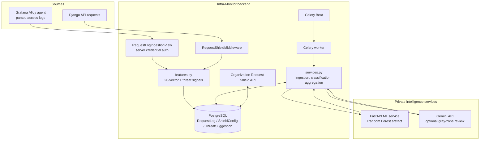
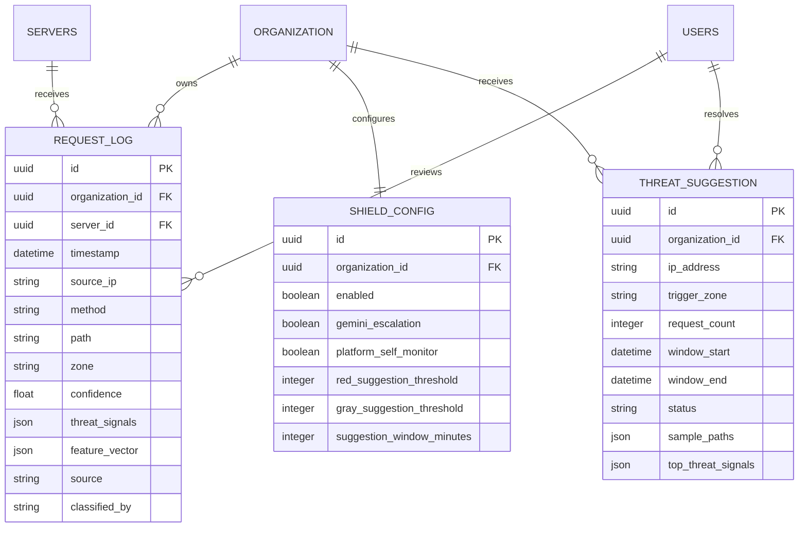
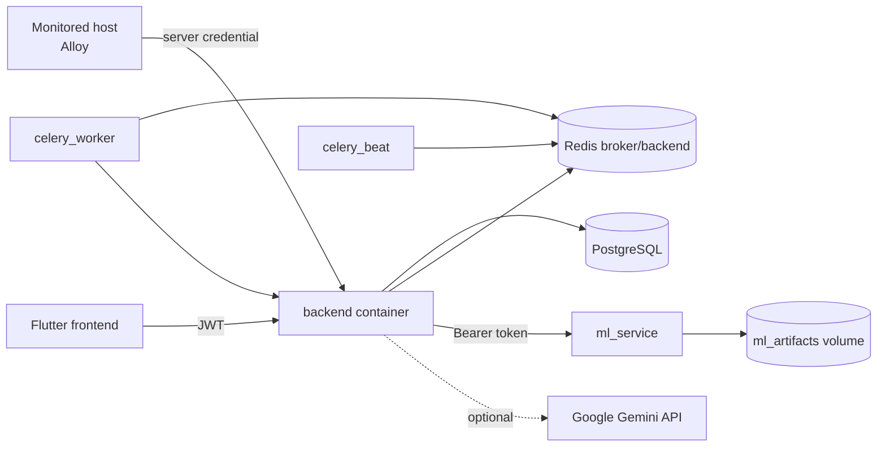

# Request Shield Architectural Blueprint

## Architectural intent

Request Shield separates collection, deterministic enrichment, probabilistic classification, optional language-model review, aggregation, and human action. Each stage persists enough state for the next stage to retry without re-ingesting the original request.

## Component blueprint



## Runtime responsibilities

### Django request path

`RequestShieldMiddleware` is registered after authentication. It measures elapsed time, derives organization identity from the URL, sanitizes selected headers, extracts the vector and threat signals, and writes one `RequestLog` row. It catches recording failures so analysis cannot change the API response outcome.

This path is synchronous at the database-write boundary. The middleware comment describes the work as fire-and-forget, but the current implementation performs `RequestLog.objects.create` before returning the response.

### Agent ingestion path

`RequestLogIngestionView` authenticates the server credential, validates the batch, confirms the server ID, and delegates to `ingest_request_logs`. The service computes vectors/signals and uses `bulk_create`, which is efficient for access-log batches.

### Classification path

The Celery task scans organizations and calls `classify_pending_batch`. The service sends a batch to the ML service with the feature-name registry and vectors. The ML service loads the request-shield artifact lazily, predicts zones and confidence, and returns results in input order. Django persists state using `bulk_update`.

The feature-name order is a cross-service schema contract:

```text
sanitize.features.FEATURE_NAMES
        == training_data.npz feature_names
        == ML request feature_names
```

Changing this list requires retraining and redeploying the model artifact.

### Escalation path

The Gemini task selects only rows that are GRAY and were classified by the ML model. It sends metadata and threat signals in a JSON-oriented prompt. Responses are accepted only when parseable and indexed to valid zones. Gemini is a second opinion, not the primary classifier.

### Suggestion path

The suggestion task aggregates classified rows in a rolling window. It creates a durable `ThreatSuggestion` for an IP/zone threshold crossing and stores sample evidence for administrator review. Existing PENDING suggestions prevent duplicate open recommendations.

## Persistence model



`RequestLog` is the event record and classification state. `ShieldConfig` is organization-scoped feature policy. `ThreatSuggestion` is a derived review record and is intentionally not an enforcement record.

## Deployment topology



The backend, worker, and beat processes share Django configuration and the database. The ML service is a separate FastAPI container and persists trained artifacts in the `ml_artifacts` volume. Redis transports Celery jobs.

## Failure behavior and recovery

| Failure                                          | Current behavior                                | Recovery path                                        |
| ------------------------------------------------ | ----------------------------------------------- | ---------------------------------------------------- |
| Feature extraction or middleware log write fails | API response continues; failure is debug-logged | Inspect logs and retry through normal traffic        |
| External batch validation fails                  | Request rejected; no batch is stored            | Correct the agent payload and resend                 |
| ML service unavailable or invalid                | Classification returns 0; rows remain pending   | A later Celery cycle tries them again                |
| No request-shield model artifact                 | ML endpoint returns 404; rows remain pending    | Preprocess data and train a model                    |
| Gemini key absent                                | Escalation is skipped                           | Configure `GEMINI_API_KEY` if required             |
| Gemini output invalid                            | No rows are updated                             | Inspect provider response/logs; rows remain eligible |
| Suggestion already PENDING                       | No duplicate is created                         | Resolve the existing suggestion                      |

## Security boundaries

1. **Tenant boundary**: organization-facing queries scope records by authenticated membership.
2. **Agent boundary**: internal ingestion requires server credentials and verifies the server ID.
3. **ML boundary**: classification and training require `ML_SERVICE_TOKEN`.
4. **Data minimization boundary**: request bodies and sensitive platform headers are excluded.
5. **Action boundary**: suggestions and verdicts do not perform network enforcement.

## Current implementation considerations

- `ShieldConfig.platform_self_monitor` is exposed by the API but is not currently checked by `RequestShieldMiddleware`.
- `ShieldConfig.enabled` prevents suggestion generation but does not currently prevent ingestion or ML classification.
- Middleware storage is synchronous despite the surrounding asynchronous Celery pipeline. High-volume platform traffic may need a queue or buffered writer.
- Analytics zone aggregates are organization-wide; the optional `source` filter currently applies to `total_requests`, not every aggregate.
- CICIDS2017 preprocessing creates HTTP-like proxies from network-flow data. Production evaluation should include labeled HTTP traffic and drift checks.
- Administrator verdicts do not currently feed model retraining. A future pipeline should export reviewed logs with provenance and validation metrics.

## Extension points

- Add or change request signals in `sanitize.features`, then update model training and compatibility checks together.
- Add ingestion sources by producing the validated `RequestLog` entry shape and calling `ingest_request_logs`.
- Add classifiers as service stages that update `zone`, `confidence`, `classified_at`, and `classified_by`.
- Add response actions separately from `ThreatSuggestion`; enforcement should not be hidden inside analytics or aggregation.
- Add observability for pending counts, classification latency, ML errors, Gemini parse failures, and suggestion creation rates.
